<p align="center">
  
</p>

<h1 align="center">Vlad Voropaev · vladthecyborg</h1>

<p align="center">
  I like taking strange questions apart, building tools around them, and sharing what I find.
</p>

<p align="center">
  <code>AI systems</code> · <code>research tooling</code> · <code>local-first experiments</code> · <code>computer vision</code> · <code>visual explanations</code>
</p>

---

### Current public work

- `local-ai-chat-exporter` — a public tool in progress.
- `voropaevv` — this profile README and visual identity layer.

Most experiments stay private until they can be published without private data, internal code, or unfinished context.

### What I usually build around

| Area | Direction |
|---|---|
| AI systems | local-first tools, agents, task workflows, chat/data export utilities |
| Research | source maps, notes, structured findings, explanation pipelines |
| Computer vision | detection, tracking, video analytics, visual systems |
| Media tooling | scripts, diagrams, README systems, visual explanations |

### Operating style

I prefer small tools that expose how something works, not large abstractions that hide the mechanism.

```text
question -> experiment -> tool -> explanation -> shared artifact
```

### Matrix layer

The visual header is generated from `scripts/generate_matrix_svg.py`.
The cursor-reactive canvas version is in `docs/` and can be hosted with GitHub Pages.
