<!--
Profile README for github.com/voropaevv.
The cursor-reactive Matrix implementation runs on GitHub Pages from /docs.
-->

  

<h1 align="center">Vlad Voropaev</h1>

  <strong>Computer Vision Engineer</strong> 
  Industrial Video Analytics · Object Detection · Object Tracking · Pose, PPE &amp; Zone Analytics · OCR

  I build multi-camera vision systems from dataset design and held-out evaluation through RTSP integration, tracking, pose logic, field iteration, and event evidence

  <a href="https://www.linkedin.com/in/thevladvoropaev/">LinkedIn</a> ·
  <a href="mailto:thevladvoropaev@gmail.com">Email</a> ·
  <a href="https://voropaevv.github.io/voropaevv/Vlad_Voropaev_Computer_Vision_Engineer_Resume.pdf">Resume</a> ·
  <a href="https://ieeexplore.ieee.org/document/10467698">IEEE Xplore</a> ·
  <a href="https://voropaevv.github.io/voropaevv/">Interactive Matrix profile</a>

  

## Industrial Computer Vision

**Crane operator safety vision system**

Owned a six-camera system end to end: built a **1,163-image / 7,499-object** dataset, trained YOLOv8m, and reached **0.932 precision**, **0.878 recall**, **0.920 mAP@0.50**, and **0.707 mAP@0.50:0.95** on a held-out test set. Implemented active-view selection, ByteTrack identities, pose-based wrist-to-pendant association, helmet checks, temporal voting, and saved event evidence; the work became a paid client customization.

**Industrial safety video analytics**

Co-developed modular RTSP analytics for PPE, danger zones, tracking and counting, equipment use, and worker activity. Offline PPE validation reached **0.906 mAP@0.50** and **0.772 mAP@0.50:0.95** on **579 images / 1,748 objects**.

**Multi-camera pilots and low-resolution CCTV**

Reviewed **17,696 CCTV frames from eight camera feeds** and curated **1,156 relevant frames** for a multi-camera industrial pilot, with view-specific zones designed to reduce long-range and duplicate detections. Built a worker-activity prototype using detection, tracking, pose, fixed zones, temporal stabilization, repeat-alert suppression, reason labels, and image/video evidence.

**Image preprocessing at Shtrih-M**

Developed and visually evaluated a Python/OpenCV workflow across **1,147 raw GRBG Bayer images** captured under varied lighting, glare, backgrounds, and packaging conditions. Documented seven processing functions, before/after comparisons, RGB histograms, adaptive decision logic, and implementation details in a **64-page technical report**.

## Research to System

**[NeuroQuest — Automatic generation of neurocomics](https://doi.org/10.1109/ACDSA59508.2024.10467698)**

Built an end-to-end RTSP-to-comic system combining detection, tracking, face and action recognition, scene interpretation, language and image generation, and PDF assembly. First author, lead writer, and oral presenter at ACDSA 2024.

`video → perception → scene understanding → narrative → generated comic`

## Open-Source Engineering

**[Jelluvi](https://github.com/voropaevv/local-ai-chat-exporter)** — a local-first browser extension for exporting AI conversations to nine portable formats without telemetry, accounts, or remote rendering, demonstrating TypeScript, browser APIs, testing, and privacy-conscious product engineering.

## Engineering Stack

- **Vision:** object detection, object tracking, multi-camera analytics, pose estimation, PPE and zone analytics, OCR, image preprocessing
- **ML:** Python, PyTorch, OpenCV, Ultralytics YOLO, TensorFlow, ByteTrack, Deep SORT, NumPy
- **Systems:** RTSP, FastAPI, Docker, PostgreSQL, GPU inference, dataset design, held-out evaluation, error analysis

Educational and historical public archive

- [Word Solver CV](https://github.com/voropaevv/words_solver_cv) — personal educational Computer Vision/OCR portfolio artifact
- [Specific questions of data analysis](https://github.com/voropaevv/specific_questions_of_DA)
- [Data science competitions](https://github.com/voropaevv/ds_competitions)
- [Applied information security tasks](https://github.com/voropaevv/applied_tasks_of_information_security)
- [Technical article: computer vision word solver](https://habr.com/ru/articles/576820/)

These repositories preserve earlier learning and public engineering history.

  Vlad Voropaev · Computer Vision Engineer · UAE

