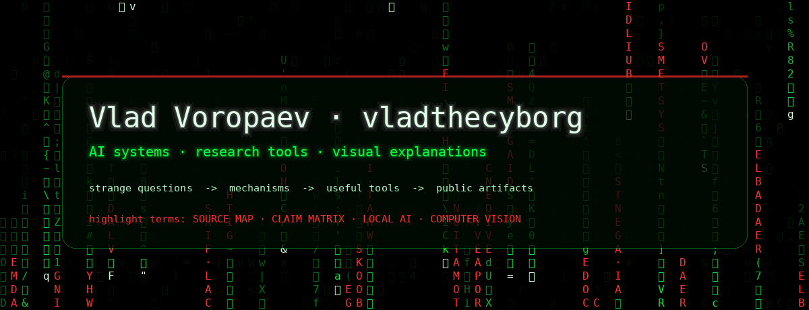

<!--
Profile README for github.com/voropaevv.
The live cursor-reactive version is published through GitHub Pages from /docs.
-->

<p align="center">
  <a href="https://voropaevv.github.io/voropaevv/">
    
  </a>
</p>

<h1 align="center">Vlad Voropaev · vladthecyborg</h1>

<p align="center">
  I like understanding complicated things, building useful tools, and turning what I find into something other people can use.
</p>

<p align="center">
  <code>AI systems</code> · <code>local-first tools</code> · <code>research workflows</code> · <code>computer vision</code> · <code>visual explanations</code>
</p>

<p align="center">
  <a href="https://voropaevv.github.io/voropaevv/">Open interactive Matrix version</a>
</p>

---

### Current build

- `local-ai-chat-exporter` — a public tool for exporting, structuring, and preserving local AI conversations.
- `voropaevv` — this profile as a visual interface, not a conventional résumé page.
- More public repositories will appear only when they are useful enough to stand alone.

### What I usually build

```text
question
  -> sources
  -> mechanism
  -> small tool
  -> public artifact
```

### Working interests

| Area | What I care about |
|---|---|
| AI systems | agents, local workflows, auditability, task memory |
| Research tooling | source maps, claim extraction, structured notes |
| Computer vision | video analysis, detection, tracking, applied CV systems |
| Public explanations | strange questions, deep explanations, visual stories |

---

<p align="center">
  <sub>UAE · building public artifacts when the public version is ready</sub>
</p>
